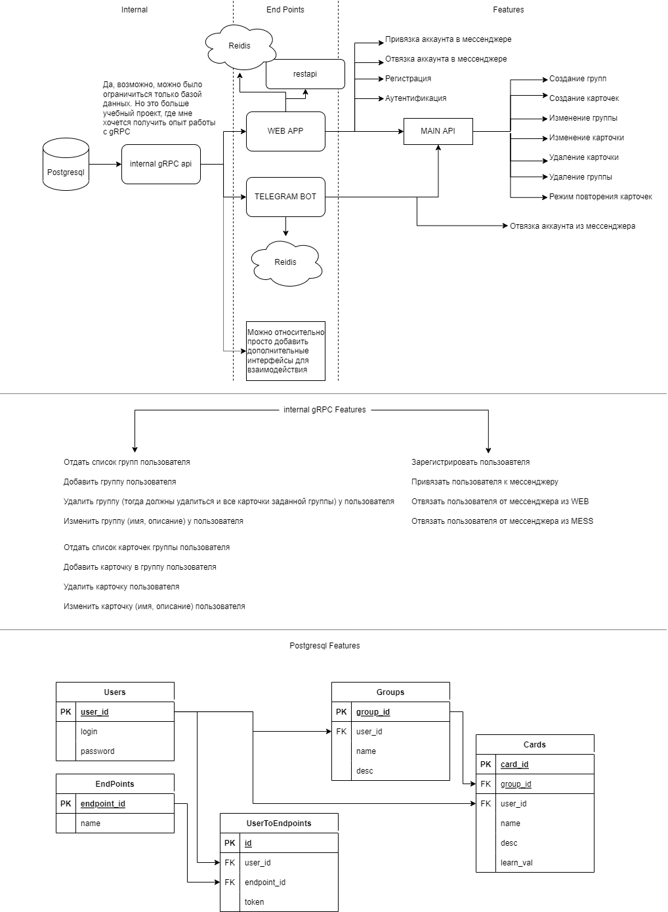

# **card-memo**
Платформа для записи и повторения карточек. 
Например слова по английскому языку, билеты по матану и т.п.

Проект является учебным. Поэтому может и будет содержать недостатки. Я буду рад любой конструктивной критике :)

Архитектура проекта выглядит так:

---
### **MVP**

- [ ] Postgresql
- [ ] internal gRPC api
- [ ] web app
- [ ] Логирование
- [ ] Тесты
- [ ] обвернуть в docker 

---
### **Что такое карточка?**
Текстовый блок информации. По сути, карточка может сожержать любую текстовую информацию.

### **Что такое группа?**
Группа - сборник однотипных карточек.
Группу можно повторить, включив режим "викторины".

